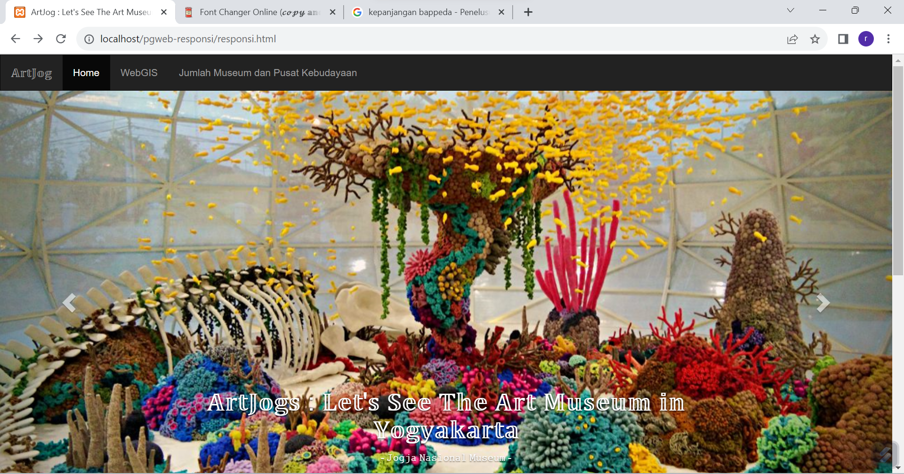
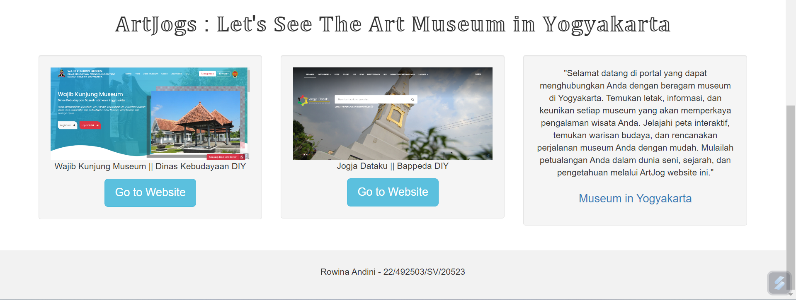
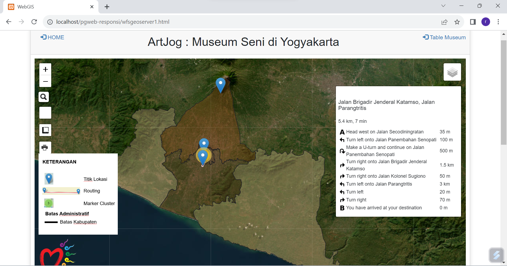
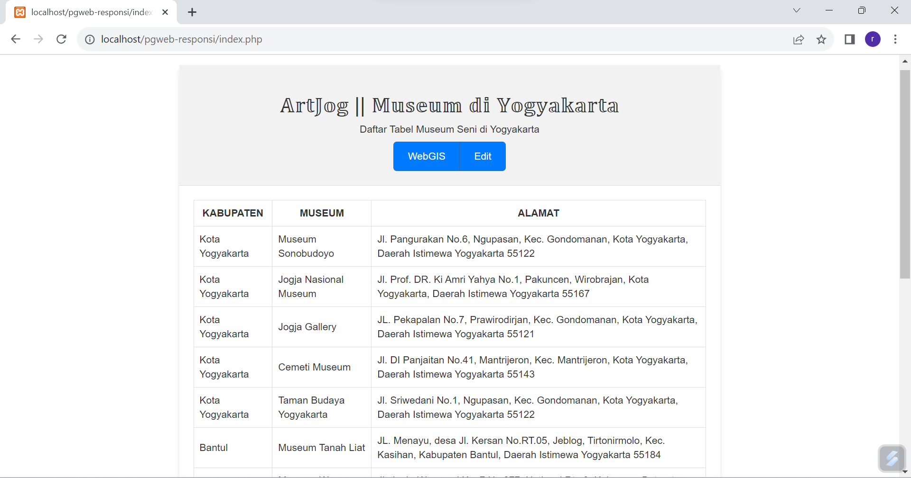
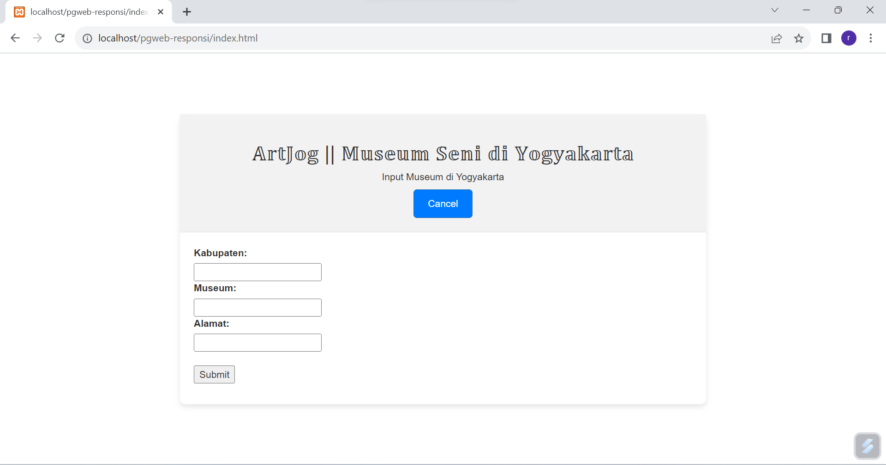
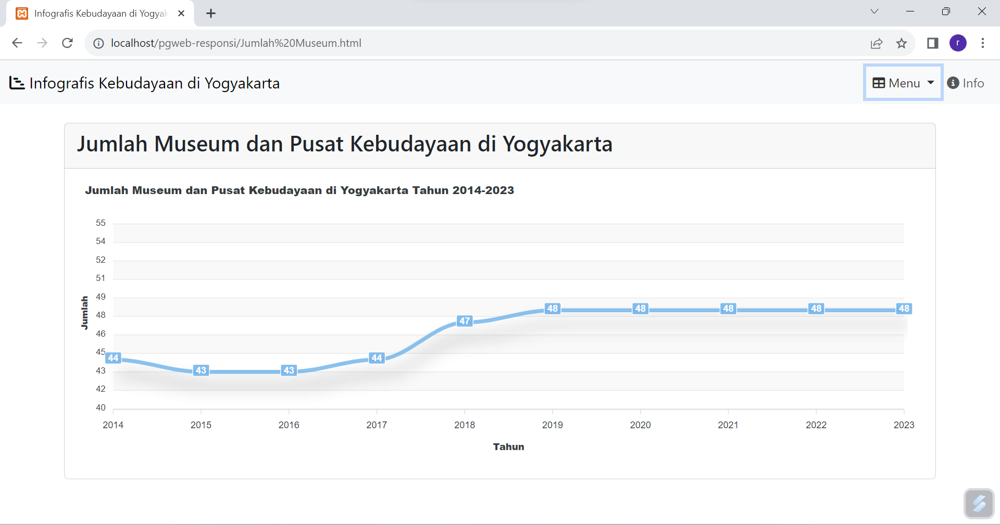

# ArtJogMuseumInYogyakarta   
ArtJog : Let's See Art Museum In Yogyakarta 

<h2>Nama Produk: ArtJog : Let's See Art Museum In Yogyakarta</h2>

<h2>Deskripsi produk:</h2>   
ArtJog : Let's See Art Museum In Yogyakarta merupakan portal yang dapat menghubungkan beragam museum seni di Yogyakarta. Temukan letak informasi, dan keunikan setiap museum yang akan memperkaya pengalaman wisata. Menjelajahi peta interaktif, melihat warisan budaya, dan dapat menjadi referensi rencana perjalanan museum dengan mudah ketika sedang berwisata di Yogyakarta. Mulailah petualangan  dalam dunia seni, sejarah, dan pengetahuan melalui ArtJog website ini. 

<h2>Komponen pembangun produk: </h2>   
<ul> 
<li>Leaflet JS: sebagai layer peta berbasis web yang dilengkapi dengan fitur dan plugin pada web</li>
<li>Geoserver: sebagai media penyimpan dan penampil data spasial layer poligon</li>
<li>Bootstrap: sebagai library penyedia script HTML dan CSS yang digunakan untuk pengembang tampilan webgis</li>
<li>Database phpMyAdmin: Sebagai penyimpan dan pengelola tabel dan database dalam web</li>
<li>Apexchart: sebagai library charting modern dalam memvisualisasikan diagram interaktif pada web</li>
<li>Xampp: sebagai server lokal untuk menjalankan aplikasi web ArtJog</li>
</ul>

<h2>Sumber data:</h2>
<ul>
<li>Data Museum Dinas Kebudayaan Daerah Istimewa Yogyakarta</li>
<li>Data Museum dan Pusat Kebudayaan Badan Perencanaan Pembangunan Daerah DIY</li>
<li>Data Titik Koordinat Museum pada Google Map</li>
</ul>

<h2>Tangkapan layar komponen penting produk:</h2>
<ul>
<li>Landing Page</li>  
  
<li>WebGIS Peta Persebaran Museum Seni di Yogyakarta</li>  
<li>Tabel Lokasi Museum Seni di Yogyakarta</li>  
<li>Edit Input Lokasi Museum Seni di Yogyakarta</li>  
<li>Diagram Jumlah Museum dan Pusat Kebudayaan Yogyakarta pada Tahun 2014-2015</li>  
</ul>